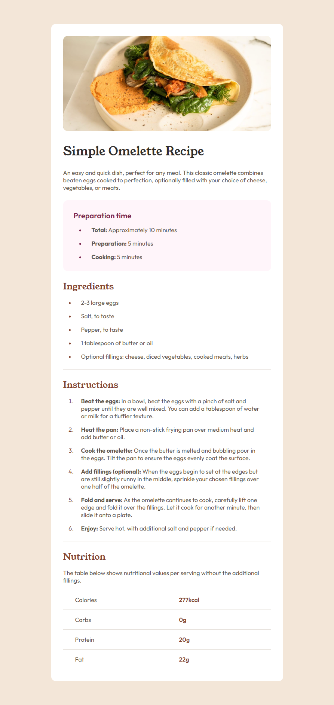

# 🍳 Frontend Mentor - Solución del reto Recipe page

Esta es mi solución al reto [Social links profile en Frontend Mentor](https://www.frontendmentor.io/challenges/social-links-profile-UG32l9m6dQ).

## Tabla de contenidos

- [Resumen](#resumen)
  - [El reto](#el-reto)
  - [Captura de pantalla](#captura-de-pantalla)
  - [Enlaces](#enlaces)
- [Mi proceso](#mi-proceso)
  - [Construido con](#construido-con)
  - [Lo que aprendí](#lo-que-aprendí)
  - [Desarrollo continuo](#desarrollo-continuo)
  - [Recursos útiles](#recursos-útiles)
- [Autor](#autor)
- [Agradecimientos](#agradecimientos)

## 💻 Resumen

### El reto

Los usuarios deberían poder:

- Ver los estados de hover y focus en todos los elementos interactivos de la página

### Captura de pantalla

### Enlaces

- URL de la solución: https://github.com/angeldavid04/recipe-page
- URL del sitio en vivo: https://angeldavid04.github.io/recipe-page/

## 💪 Mi proceso

### Construido con

- HTML5 semántico
- Propiedades personalizadas de CSS
- Flexbox
- First Mobile

### Lo que aprendí

Aprendí a como estilizar y crear tablas de aspecto minimalista. También, aprendí qué es lo que sucede cuando usas un font-weight que no está definido para una fuente externa.

### Desarrollo continuo

Quiero seguir mejorando mis habilidades de maquetado en CSS, también me gustaría mejorar la optimización del código usando buenas prácticas. Sobre todo, me gustaría mejorar en mi manejo de flexbox y grid.

### Recursos útiles

- [MDN Web Docs](https://developer.mozilla.org/es/) - Este recurso es muy bueno y me ayuda sobre todo a escoger funciones y características que funcionan en cualquier navegador.

## 🤓 Autor

- Frontend Mentor - [Angel López](https://www.frontendmentor.io/profile/AngelDavid-dev)

## ♥️ Agradecimientos

Le quiero dar un agradecimiento a mi maestros del bachillerato porque sin ellos no fuera quien soy ahora, JonMircha por ser un gran docente digital y enseñarme los fundamentos del desarrollo web, y a Lucas Dalto por ofrecerme muy buenos cursos para aprender y repasar.
